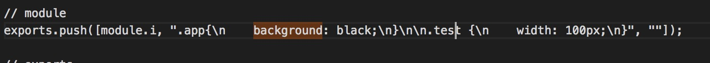

# AsyncDemo（目前使用的是静态路由）
## 第一步 目录结构
	AsyncDemo
	|
	|
	|------>src/app(存放源代码)
	|	|
	|	|
	|	|------>index.js(启动app前的配置项)
	|	|
	|	|
	|	|------>store.js
	|	|
	|	|
	|	|------>home.html
	|	|
	|	|
	|	|------>rootReducer.js
	|	|
	|	|
	|	|------>common(存放通用资源，至少是两个模块都会引用的资源才会放到这里，否者放在模块自己的目录下)
	|	|	|
	|	|	|
	|	|	|------>globalActions()
	|	|	|
	|	|	|
	|	|	|------>globalReducers()
	|	|	|
	|	|	|
	|	|	|------>globalUtils()
	|	|	|
	|	|	|
	|	|	|------>globalCss()
	|	|	|
	|	|	|
	|	|	|------>res(存放资源)
	|	|	|	|
	|	|	|	|
	|	|	|	|------>images
	|	|	|	|
	|	|	|	|
	|	|	|	|------>fonts
	|	|	|
	|	|	|
	|	|	|------>libs(存放非node_module方式引入的包)
	|	|
	|	|
	|	|------>modules(存放各个模块)
	|	|	|
	|	|	|
	|	|	|------>first(第一个模块)
	|	|	|	|
	|	|	|	|
	|	|	|	|------>index.js(动态加载渲染路由，如果一次性加载路由，可取消该项）
	|	|	|	|
	|	|	|	|
	|	|	|	|------>main.js(渲染html)
	|	|	|	|
	|	|	|	|
	|	|	|	|------>actions.js
	|	|	|	|
	|	|	|	|
	|	|	|	|------>reducers.js
	|	|	|	|
	|	|	|	|
	|	|	|	|------>components(存放页面级的模块)
	|	|	|	|	|
	|	|	|	|	|
	|	|	|	|	|------>header
	|	|	|	|	|	|
	|	|	|	|	|	|
	|	|	|	|	|	|------>index.js
	|	|	|	|	|	|
	|	|	|	|	|	|------->index.css
	|	|	|	|	|
	|	|	|	|	|
	|	|	|	|	|------>content(同header)
	|	|	|	|	|
	|	|	|	|	|
	|	|	|	|	|------>footer(同header)
	|	|	|	|
	|	|	|
	|	|	|
	|	|	|------>second
	|	|	|
	|	|	|
	|	|	|------>third
	|
	|
	|
	|------>configs(各种根目录下的配置文件)
	|
	|------>tools
	|
	|
	|------>static/dist(构建目录)
	|
	|
	|------>node_modules

`结论`：

	通用的东西全部到common目录下查找。
	modules目录下是相互独立的模块。
	非业务基础组件拉出去，作为单独的项目。
	通用业务组件拉出去，作为单独的项目。
	特有组件则单独开发，并存放在compoennets目录下。
	非业务组件------>业务组件------>页面------>应用


## 第二步 npm install

## 第三步 loaders
* `储备知识：DataURL，Base64`

	1、DataUrl技术，就是将图片数据以base64形式压缩编码，以字符串形式直接嵌入到目标文件中（html，css），目前大部分主流浏览器都支持。
	2、Base64编码的数据体积通常是原数据体积的4/3，即比原数据大。
	3、DateURL形式的图片不会被浏览器缓存。（通过css文件简介缓存DateUrl形式的图片）
	4、webpack只能处理javascript，其它资源需要使用loader进行转换
	5、loader：
* `file-loader`
	
	拷贝图片到指定的位置并返回对应的url或者仅仅返回一个url。[更多资料](https://github.com/webpack-contrib/file-loader)
	```
	var url = require("file-loader!./file.png");
	// => 根据file.png在输出目录emit a file，并返回对应的url
	//=>"/publick-path/000000000(hash).png"
	var url = require("file-loader?emitFile=false!./file.png");
	// not emit a file
	```
* `url-loader`

	将指定大小的图片进行base64压缩编码，并返回对应的DataUrl。[更多资料](https://github.com/webpack-contrib/url-loader)
	```
	import img from './image.png';
	```
	webpack.config.js
	```
	{
		test: /\.(png|jpg|jpeg|gif)$/,
		use:[
			{
				loader: 'url-loader',
				options: {
					limit: 8192,
					mimeType:"文件后缀，imgage/png",
					prefix:"传递给file-loader的参数"
				}
			}
		]
	}
	```
	`注意：`配置了url-loader后，就不需要安装配置file-loader
* `css-loader`

	css-loader会像解析import/require一样将解析import和url()，并自行处理它们的解析。

	`css-loader并没有将css解析成样式树，而是将它的整个内容作为一个字符串打包进js中。`

	

	loader会将其它资源打包成js。
* `style-loader`

	通过注入style标签的形式，讲css添加到dom上。
	
# plugins
* `webpack.optimize.CommonsChunkPlugin`
* `webpack.ProvidePlugin`
* `webpack.DefinePlugin`
* `clean-webpack-plugin`
* `copy-webpack-plugin`
* `html-webpack-plugin`
* `extract-text-webpack-plugin`
* `webpack-md5-hash`
* `webpack-mainfest-plugin`